# USB sniffer for RASPBERRY PI PICO RP2040

This is a simple PS2 sniffer based on a Raspberry Pi PICO RP2040 (pico-sdk).

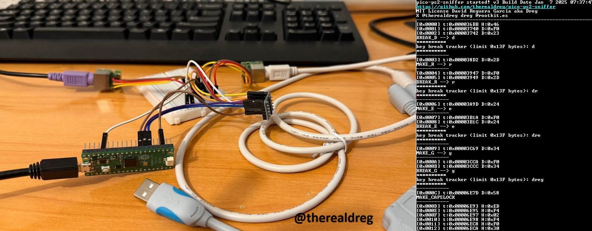

I created this project to ensure that all the effort I put into my okhi project (Open Keylogger Hardware Implant - USB & PS2 Keyboards) can benefit more people: https://github.com/therealdreg/okhi


# Reporting issues

If you have a PS2-USB adapter that doesn't work with the sniffer, please send me some captures of the device using a logic analyzer or the pico-ps2-diagnostic-tool. This tool is designed to capture and replay signals on a PS/2 interface, specifically targeting the DATA and CLOCK lines:

https://github.com/therealdreg/pico-ps2-diagnostic-tool

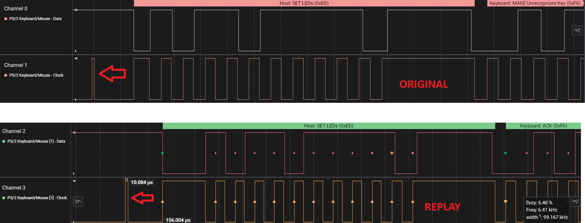

 A short pulse was captured on the original CLOCK signal, and the replayed signal successfully reproduced it.

# Download last firmware

Download the latest firmware from the releases section:

https://github.com/therealdreg/pico-ps2-sniffer/releases/latest

# Flashing the firmware

To flash the firmware, you need to put the Raspberry Pi Pico in bootloader mode. To do this, press and hold the button while connecting the USB cable to the PC. The Pico will appear as a USB mass storage device. Drag and drop the "pico_ps2_sniffer.uf2" firmware file to the Pico.

# Physical PS2 keylogger using a Raspberry Pi Pico

First of all, **PS2 signals are 5V**, and the Raspberry Pi Pico is 3.3V. To avoid damaging the Pico, we need to use a level shifter! Never connect PS2 signals directly to the Pico!

## Materials

**TWO** Ps/2 Adapter Ps/2 Ps2 Keyboard Keypad Module For Arduino:


https://www.aliexpress.com/i/32802677672.html

USB Converter Cable for Keyboard Mouse USB Male to PS2 Female Converter adapter Cable:

https://www.aliexpress.com/item/32850416717.html

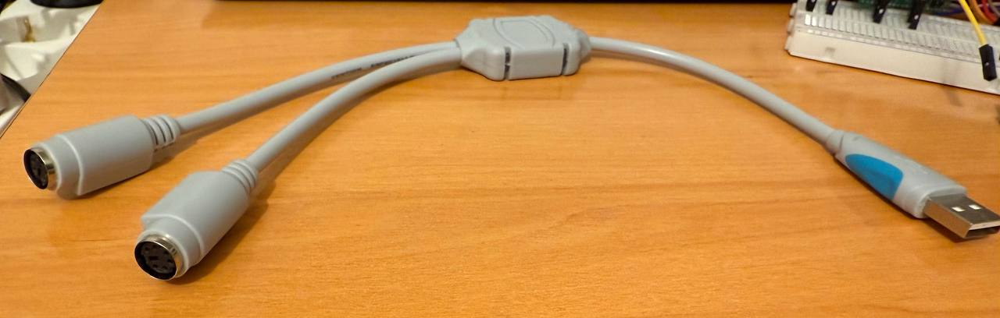


I2C Logic Level Converter **PRE-SOLDERED** Bi-Directional 3.3V-5V 4 Channels

https://www.amazon.com/-/es/Convertidor-pre-soldado-bidireccional-compatibles-microcontroladores/dp/B0CL2PFHMW?th=1

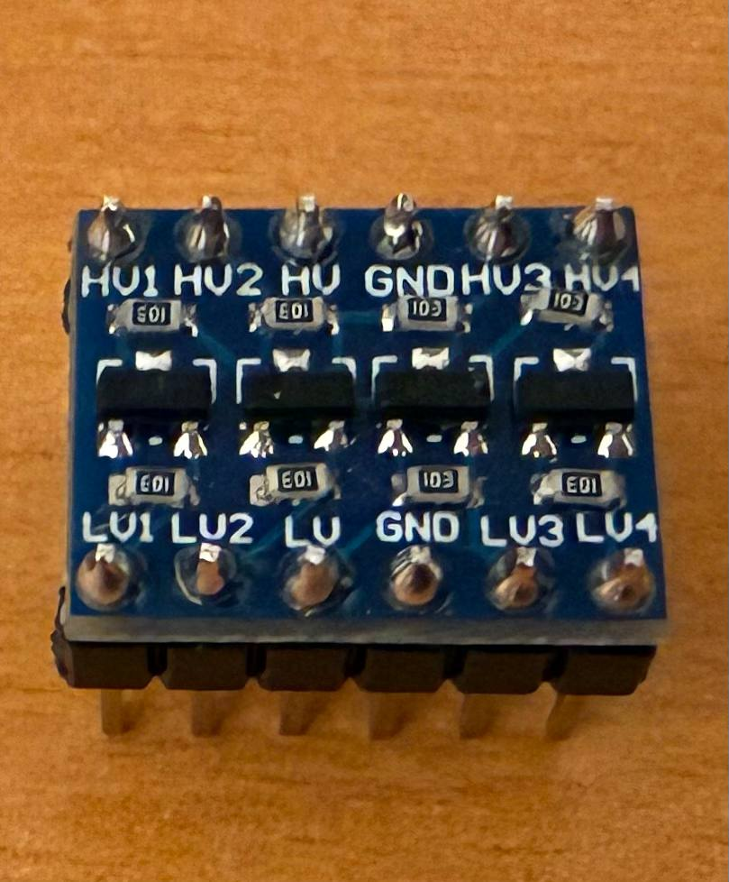

PS2 Male to PS2 Male cable:

https://www.aliexpress.com/item/32833081345.html

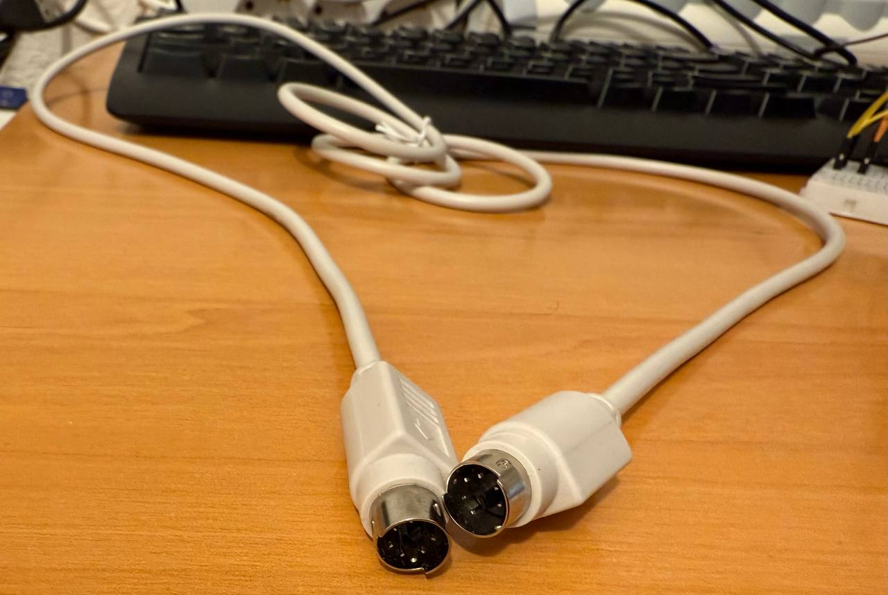

Lenovo PS2 Keyboard:

https://aliexpress.com/i/1005006032883103.html

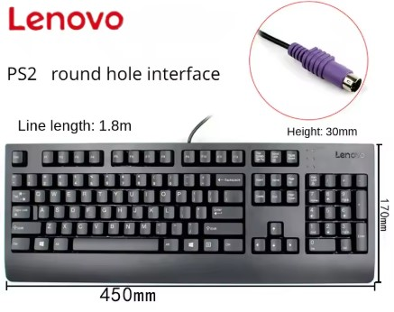

-------

I assume you have a breadboard, a set of Dupont cables (male-to-male, female-to-male, female-to-female), and a Raspberry Pi Pico.

## Connect everything

1. Connect the Lenovo PS2 Keyboard to the PS2-pin board:

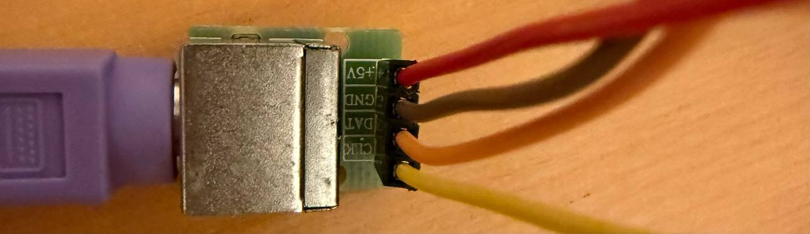

Connect PS2-pin board with the dupont cables to breadboard:

- Yellow: Clock
- Orange: Data
- Red: VCC
- Brown: GND

Each cable to one row of the breadboard.

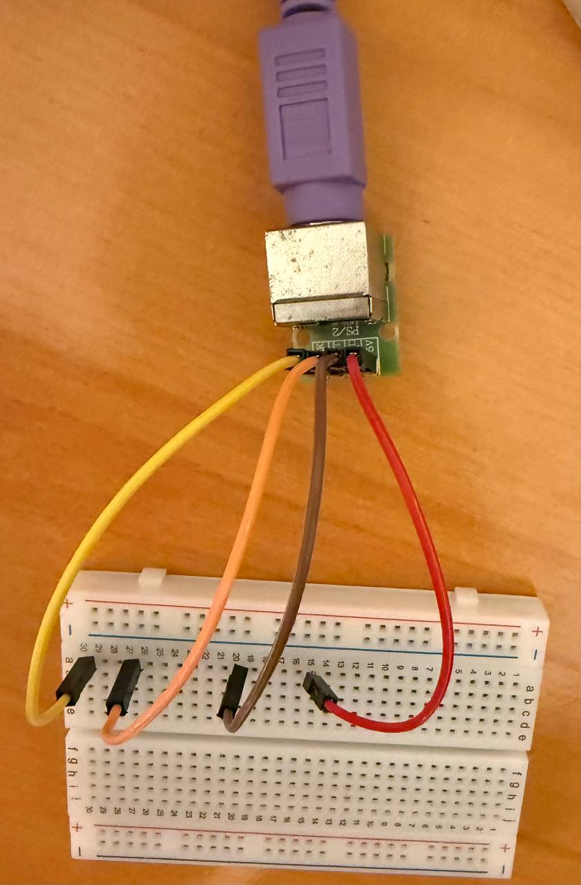

Connect USB to PS2 adapter cable to the PS2 MALE CABLE and The USB PS2 Male cable to the other PS2-pin board.

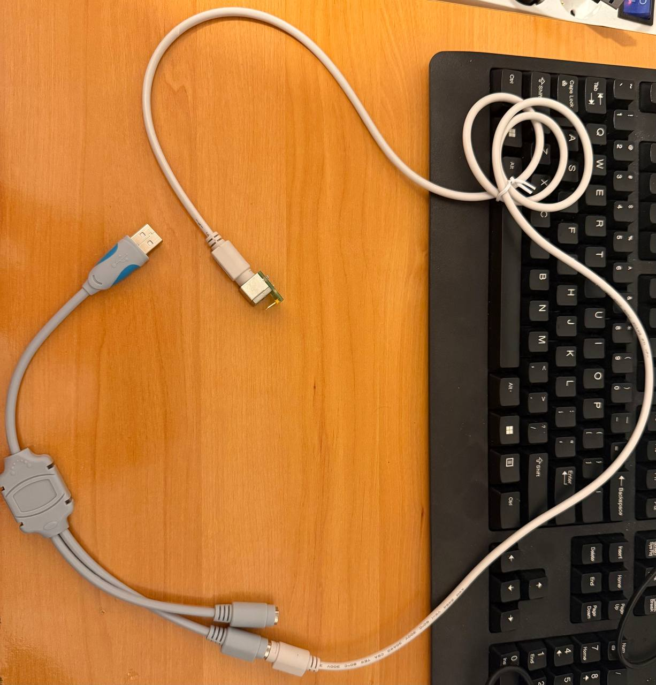

Connect PS2-pin board with the dupont cables to breadboard, to join the PS2 signals of the two PS2-pin boards:

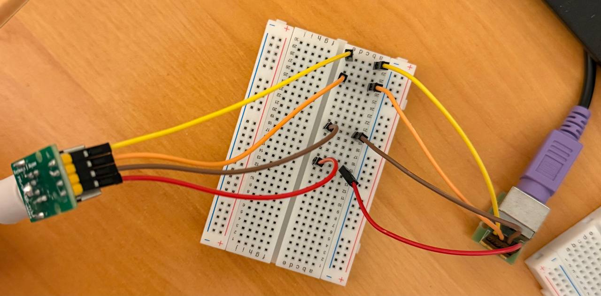

Connect the USB to PS2 adapter to the PC. If the keyboard is working well done, if not, check the connections.

Disconnect the USB to PS2 adapter from the PC.

Now connect the I2C Logic Level Converter to the breadboard:

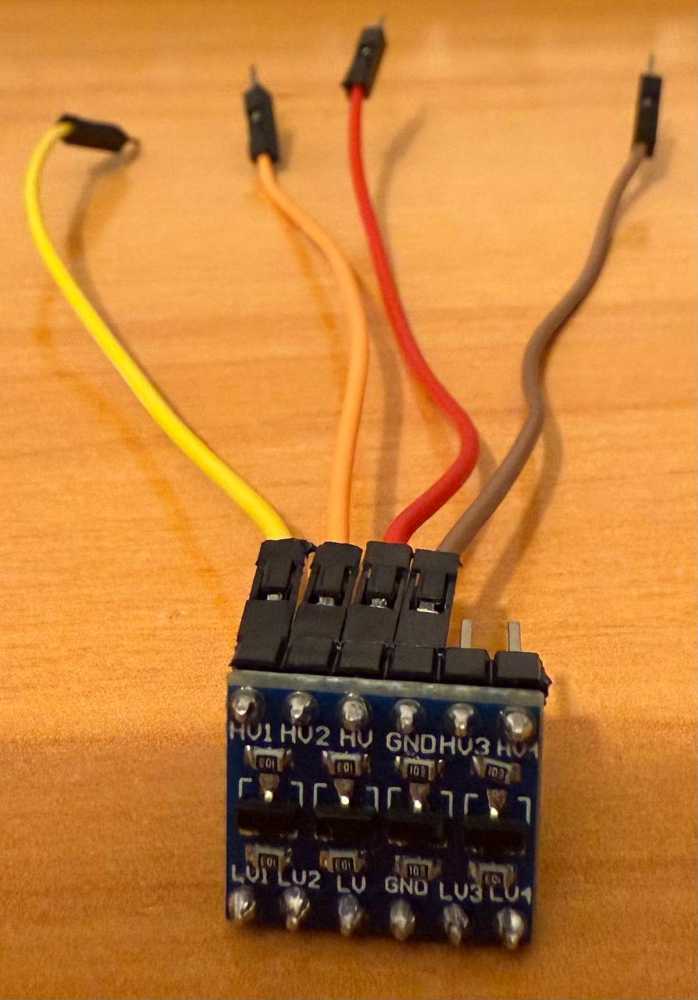

- HV1: YELLOW
- HV2: ORANGE
- HV: RED
- GND: BROWN

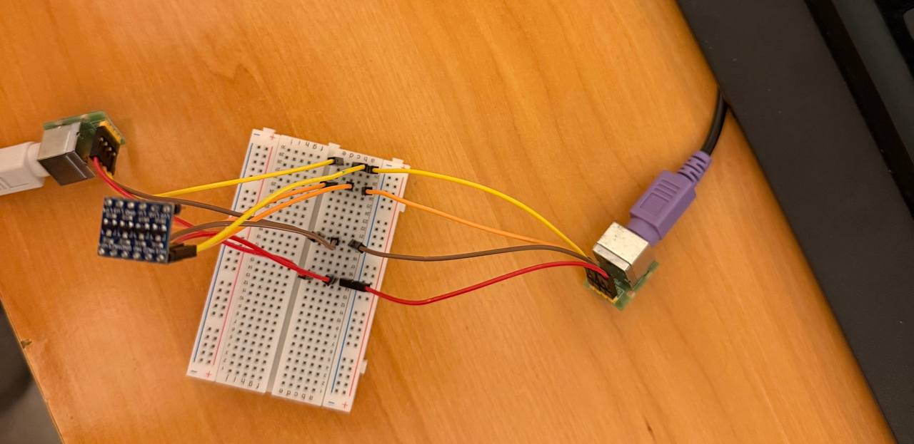

Its easy, same colours go to the same breadboard row. ALWAYS CHECK THE CONNECTIONS!

Now connect the Raspberry Pi Pico to the breadboard:

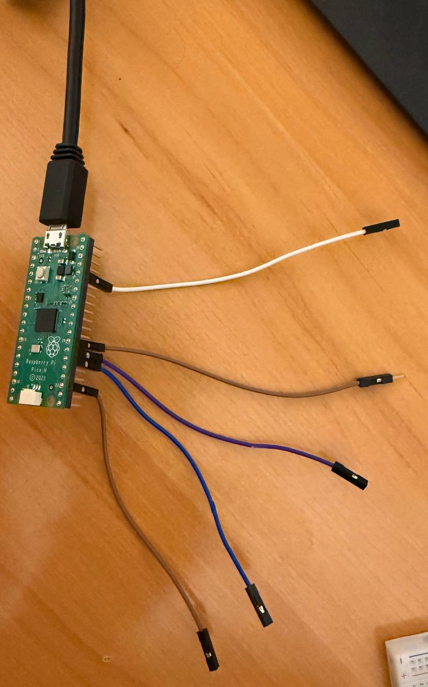

- PIN36 (3V3 OUT): WHITE
- PIN27 (GPIO21, SNIFF CLOCK): PURPLE
- PIN26 (GPIO20, SNIFF DAT): BLUE

Connect two brown cable to two ground pins of the Pico, and connect one to the breadboard (brown row) and other to the I2C Logic Level Converter (GND).

Connect from the I2C Logic Level Converter to the Raspberry Pi Pico:

- WHITE: LV
- PURPLE: LV1
- BLUE: LV2
(GND is already connected to PICO)

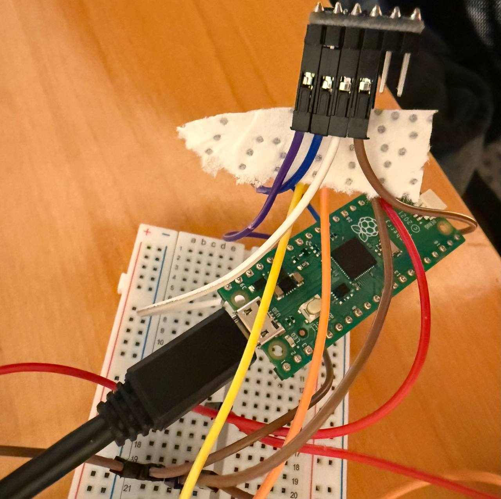

At this point all 5v signals are converted to 3.3v signals. And our Raspberry Pi Pico is safe!

All we have done is to bring all the signals together and make them accessible using the breadboard, then convert them to 3.3V to prevent damaging the Pico.

Finally, connect everything to the PC, and you're done! (Raspberry Pi Pico & USB to PS2 adapter).

**WARNING**: some USB Hubs can cause problems with this setup. If you have problems, try connecting ALL directly to the PC.

**WARNING**: Use short cables to avoid signal degradation (USB & Dupont). Avoid stack adapters, etc.

## Inspecting PS2 traffic

Connect to serial PORT (COM PORT) with a terminal program (like Putty, Tera Term, etc.), port conf:
- 9600 bauds
- data 8 bits
- parity none
- stop bits 1
- flow control none

To view available COM ports on Windows, open Device Manager and look for the "Ports (COM & LPT)" section.

**The COM port becomes available approximately 4 seconds after connection** (the firmware includes a delay before it starts).

Now, jus type on the PS2 keyboard and see the magic!

```
pico-ps2-sniffer started! v3 Build Date Aug 19 2025 21:37:38
https://github.com/therealdreg/pico-ps2-sniffer
https://github.com/therealdreg/okhi
MIT License David Reguera Garcia aka Dreg
X @therealdreg dreg@rootkit.es
---------------------------------------------------------------
DAT_GPIO: 20
CLK_GPIO: 21
AUX_D2H_JMP_GPIO: 22
AUX_H2D_JMP_GPIO: 19
okhi led GPIO: 26
okhi USSEL GPIO: 8
okhi USOE GPIO: 9

[0x0000] t:0x0000469C H:0xED
[0x0001] t:0x0000469D D:0xFA
[0x0002] t:0x0000469F H:0x02
[0x0003] t:0x000046A1 D:0xFA
[0x0004] t:0x0000580B D:0x23
MAKE_D --> d
-----------
[0x0005] t:0x00005887 D:0xF0
[0x0006] t:0x0000588B D:0x23
BREAK_D --> d
**********
key break tracker (limit 0x13F bytes): d
**********
-----------
[0x0007] t:0x00005DA9 D:0x2D
MAKE_R --> r
-----------
[0x0008] t:0x00005E2C D:0xF0
[0x0009] t:0x00005E30 D:0x2D
BREAK_R --> r
**********
key break tracker (limit 0x13F bytes): dr
**********
-----------
[0x000A] t:0x000060C6 D:0x24
MAKE_E --> e
-----------
[0x000B] t:0x00006132 D:0xF0
[0x000C] t:0x00006136 D:0x24
BREAK_E --> e
**********
key break tracker (limit 0x13F bytes): dre
**********
-----------
[0x000D] t:0x00006663 D:0x34
MAKE_G --> g
-----------
[0x000E] t:0x000066C8 D:0xF0
[0x000F] t:0x000066CC D:0x34
BREAK_G --> g
**********
key break tracker (limit 0x13F bytes): dreg
**********
----------
```

# Compatible adapters

Check the list of compatible adapters here:

https://github.com/therealdreg/okhi?tab=readme-ov-file#ps2-usb-adapters-working-with-okhi

# Adapter from hell

Creating a real-world keylogger has been challenging and is still in beta. Take a look at some adapters on Amazon: they produce a peculiar long CLOCK signal each time, along with short pulses before the actual packet.

The PIO code must be compatible with these kinds of signals. Although the protocol should follow the standard and theoretically shouldn’t matter, unexpected behaviors occur in real-world scenarios.

Additionally, I found adapters that intermittently emit short pulses of various types, featuring fast rise and fall edges.

Supporting the "Adapter from hell" was a pain, check this:

https://github.com/therealdreg/okhi?tab=readme-ov-file#idle-behavior-adapter-from-hell

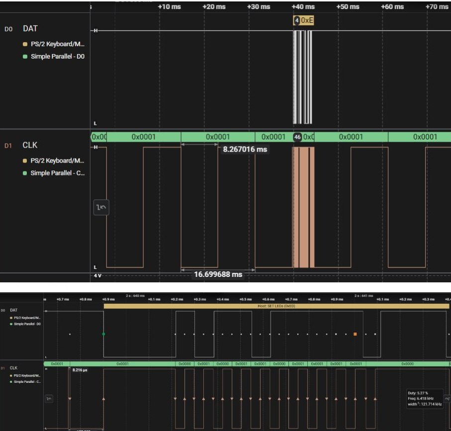

Another PS2 to USB Adapter from Aliexpress with a fast 1.8us low pulse (CLOCK LINE):

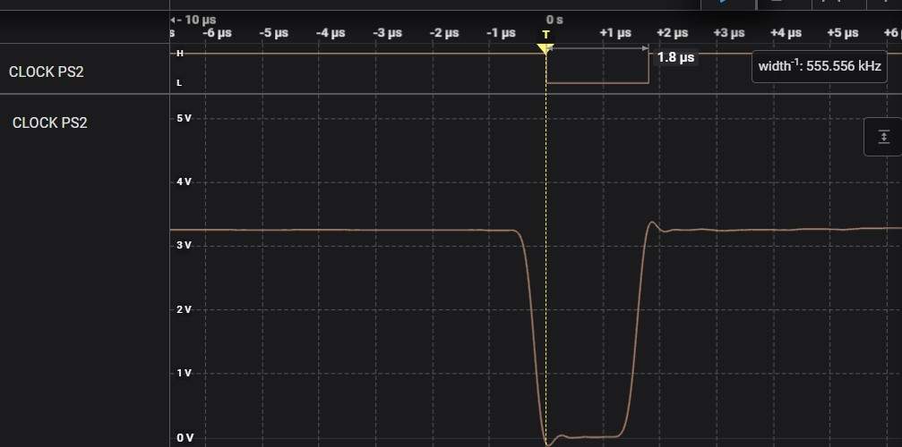

Note: These types of "glitches" do not affect the functionality of the PS2 keyboard and the adapter in any way, but they are a problem when creating a generic sniffer.

# GPIO used by the sniffer

| PICO PIN | GPIO    | Function | USB Cable Color |
|:--------:|:-------:|:----------------:|:-----:|
| GND      | GND     | Ground           | N/A   |
| 26       | GPIO20  | PS2 DAT          | N/A   |
| 27       | GPIO21  | PS2 CLK          | N/A   |
| 29       | GPIO22  | PIO (internal)   | N/A   |
| 25       | GPIO19  | PIO (internal)   | N/A   |
| 11       | GPIO8   | okhi (internal)  | N/A   |
| 12       | GPIO9   | okhi (internal)  | N/A   |
| 31       | GPIO26  | okhi led         | N/A   |


# Learn resources

- https://github.com/therealdreg/okhi
- https://forums.raspberrypi.com/
- https://datasheets.raspberrypi.com/pico/getting-started-with-pico.pdf
- https://datasheets.raspberrypi.com/pico/raspberry-pi-pico-c-sdk.pdf
- https://datasheets.raspberrypi.com/rp2040/rp2040-datasheet.pdf
- https://github.com/therealdreg/okhi/blob/main/stuff/PS2_Keyboard.pdf

# Related

- https://github.com/therealdreg/pico-usb-sniffer-lite
- https://github.com/therealdreg/pico-ps2-diagnostic-tool

# Developers

Instructions for building & debugging the firmware step-by-step can be found in the okhi repository:

https://github.com/therealdreg/okhi?tab=readme-ov-file#developers-setup


# CHANGELOG

## v3 2025-08-19

- okhi support: led, usb switch, button press...
- better DOC
- minor & cosmetic changes

## v1 2025-01-21

- Initial version from okhi project